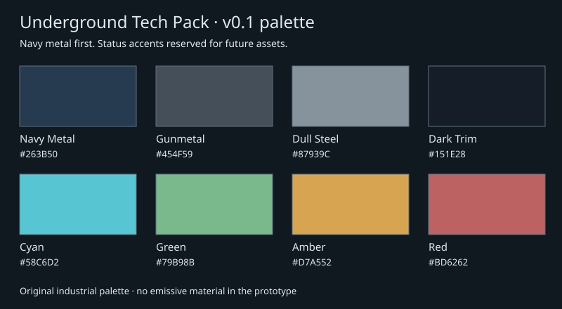

# Underground Tech Pack — v0.1

A free, original decorative building kit for underground technology environments. This branch contains **Milestone 0 only**: one navy metal prototype and the development pipeline. **Android acceptance passed, reported by Dan on 9 October 2026; ready for review after CI.**

[Canonical Crew Brief](https://docs.google.com/document/d/1WGthGOh2_vrdjSrjwmkx6YfAtmFI9gC1AgpEYUUmZ-k/edit) · [Conventions](docs/conventions.md) · [Originality rules](docs/originality.md) · [Validation](tests/validation.md) · [Development lab](../../worlds/underground-tech-pack-lab/README.md)



## Build and verify

From the repository root, with Python 3.12+ and no third-party dependencies:

```sh
python3 tools/utp.py validate
python3 -m unittest discover -s tests -v
python3 tools/utp.py build
```

`dist/underground-tech-pack-0.1.0.mcaddon` contains only the player behavior/resource packs. `dist/underground-tech-pack-0.1.0-dev.mcaddon` adds the optional lab setup pack. Both contain identical player packs; use the development bundle for Milestone 0 testing. Checksums are in `dist/SHA256SUMS`.

After editing palette or pixel-grid artwork, run `python3 tools/utp.py render`, then validate and review. Generated archives stay outside Git. A future approved release must archive the exact device-tested package in GitHub Releases.

## Android import and placement

1. Record the Minecraft title-screen version/build. The provisional minimum is **1.21.80**; the Captain-confirmed Android test target is **1.26.52.3**, with Android acceptance subsequently confirmed by Dan.
2. Transfer the development `.mcaddon` to Android and use the file manager's **Open with Minecraft** action. Wait for all three packs to import. File-manager behavior varies; record import errors.
3. Create a new Creative, Flat, Peaceful world named **UTP Development Lab**. Enable coordinates and cheats; leave experiments off. Activate **Underground Tech Pack — Behavior**, verify **Underground Tech Pack — Resources** is active, and enable **UTP Development Lab — Setup Only**.
4. Search Construction for **UTP Navy Metal**; also test `/give @s steelwater_utp:navy_metal 64`.
5. Follow the [lab setup](../../worlds/underground-tech-pack-lab/README.md) and [Android checklist](tests/validation.md).

The prototype is a full cube with the same navy panel on all six faces. Screens, pipes, furniture, doors, machinery, animations, recipes, and gameplay interactions are outside this milestone.

## Status and rollback

Dan confirmed Android testing passed without issues in [PR #1](https://github.com/steelwater/steelwater-minecraft/pull/1#issuecomment-6074793838). See [validation](tests/validation.md) for Captain-reported results and evidence limitations. The Crew did not independently repeat Minecraft playtesting.

The starter remains on `main`; Milestone 0 is isolated on `feature/underground-tech-pack-m0`. Test only in a dedicated new world. Preserve the world and matching packs together. No deployment or release has occurred.
